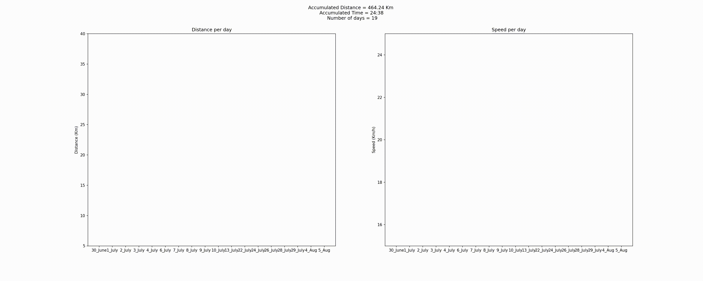

# bike_tracker
A few months ago i decided to take up cycling as a new hobby (to spend some time away from my screen obviously), so i decided to write down a simple notebook to help me track and my performance (speed and distance per day, overall distance, number of days, number of totals hours).
- It can be used with a .xlsx table that has 3 columns : Date, Distance and Time 

## Output

